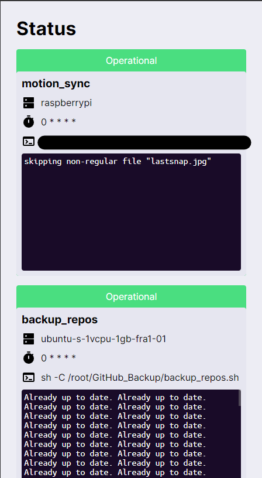

# crontab_status

this allows you to check if your corontab jobs actually run and if they are successful. Clients have to report the result of the job to the server. If they failed to report in time or report a non-zero exit code an alarm is triggered.

# setup

1. install rust, cargo and trunk
2. On the server:

- 1. cd into the "frontend" directory
- 2. run `trunk build --release`
- 3. cd into the "../server" directory
- 4. copy "config.toml.example" to "config.toml"
- 5. edit "config.toml". To create new jobs copy the first line below the job section and edit it's name (id) and optionally provide a webhook that is to be called, when the job failed. Note that the contab times currently don't support ranges. Crontab times are checked against utc
- 6. run `cargo run --release`

3. On the client

- 1. cd into the client directory
- 2. run `cargo install --path .`
- 3. then edit your crontab config
- 4. prefix the jobs (after the crontab time) you added to your config.toml in the server section with `crontab_status_client --id your-job-id --password your-password --address http://server.address:port -- `

4. Now you should be good to go. Visit the port the server opened and you should see the gui.

